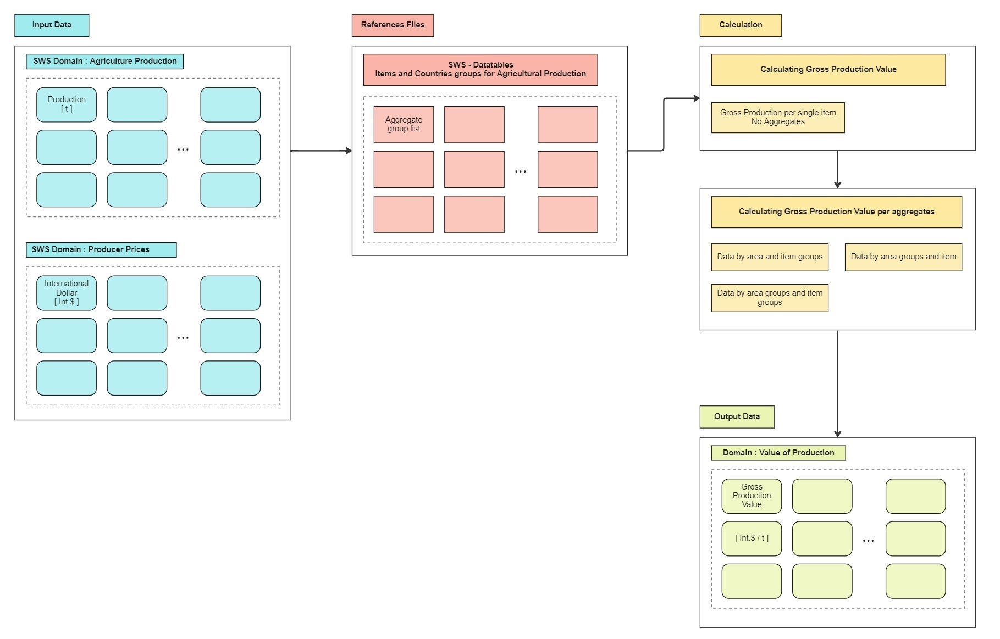

# Value Of Agricultural Production 

Production and producer prices are defined according to established FAO standards. For instance the concept of production may change according to the specific commodity and can be summarized as follows: 

**Crop production data** refer to the actual harvested production from field or orchard and gardens, excluding harvesting and threshing losses and the part of crop non harvested. Production includes also the quantities sold in the market (marketed production) and the quantities consumed by the producers (autoconsumption).
Crop production is stored in metric tonnes.

**Livestock production data** is more commodity-specific, evaluated by weights and adjusted by conversion factors to provide comparable data.

**Producer prices** refers to the prices received by farmers per unit, usually a metric ton of product. The producer prices are also often defined "farm gate prices", and should includes all the costs incurred by the farmers to produce the commodity and its own profit.

Various approaches are considered for the definition of _Agricultural Production_, spacing from _gross_ concept to _net_ depending on the treatment of the double-counting error. The latter is defined as the error that incur when we do not remove inputs used during the production cycle. 
Agricultural inputs are indeed divided in three categories :

  1. commodities required as inputs for their own production, such as seed or hatching eggs;
  2. Inputs of other agricultural commodities as those used for feeding livestock;
  
  3. Non-agricultural inputs such fertilizers or pesticides.
  

## Gross Production Value 

Value of gross production is calculated by multiplying gross production (in tonnes) by production prices at farm gate. In this phase of aggregation the overall value of production in considered. Indeed a double-counting error rise if we do not remove seeds and feed used within the agricultural sector, we refer then to this value as "gross production".
Value of gross production is provided in both International Dollar [Int.$] and Standard Local Currency [SLC].
Value of production expressed in constant terms is derived using the average
prices of three selected years, named base period. Constant price series shows the changes in quantity or volume of the product changes over time.

[...] 

 

## Gross Prooduction Value Plugin 

The Gross Production Value plugin have the following workflow :
 

From **Input data --> Reference tables --> Gross Production calculations --> Final Output**
 

{ width=150% }

The inputs for the Gross Production plugin are the Agriculture Production value and International Dollar Prices. The calculation will be performed for all the items defined in the supporting table and then aggregated at item group level and countries group level.
If the production data in not available for a certain commodity, through the function `production_gap_filler.R`,  the plugin will perform a three year mean of the production value of the three past years. If also this information are not provided, it will take the last available production value in the past.

### Supporting R function

Description of the supporting R function written for the plugin.

#### production_gap_filler.R

To provide the Value of Production plugin a more consistent dataset, some of the production data are estimated through this plugin. 
For computation speed purpose, the plugin will detect only rows with non available data (`NA`) and will attempt to fill them. The procedure follows data flow shown in [figure](#fun_data_flow) below. 
The function will detect the missing values and try to perform a three year average of the production value of the three years before. If this data is not available it will scan for the first available production value in the past and will replicate its value. The plugin will return `NA` if no production values is found in the past for the specific country and commodity. 

{#fun_data_flow width=150% }

## Aggregates

The plugin calculate the Gross Production value at different aggregation value :

  - item groups and area 
  
  - area groups and item
  
  - item groups and area groups.
  
The items and countries group lists are obtained from the "Definitions and Standards" section of the dissemination platform website ( [FAOSTAT](https://www.fao.org/faostat/en/#data/QV) ).
They are described and reported on the [SWS Resources section](#resources) section of this documentation.

It is important that the technical unit validate those table to ensure that they are up-to-date and the right aggregations are performed. 

## Run the module

  1. Log-in into [SWS](https://sws.fao.org/);
  
  2. Select **New Query** and choose `Test - Ivan Sortino` (Provvisorio) Domain and `Gross Production Value` dataset;
  
  3. Select the geographicAreaM49, measuredElement, measuredItemCPC and timePointYears in which you are interested and run the query;
  
  4. Once you created your session select run plugin as shown in [picture below](#screenuno);
  
{#screenuno scale=110% }

  5. Select the parameters: base year and level of aggregation. 
  
{#screenuno scale=110% }  
