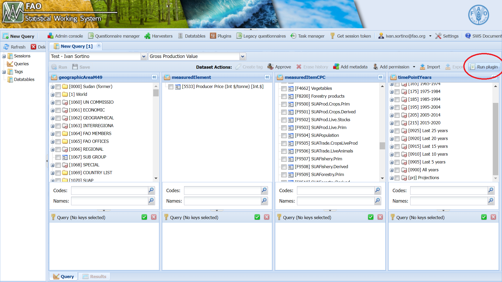
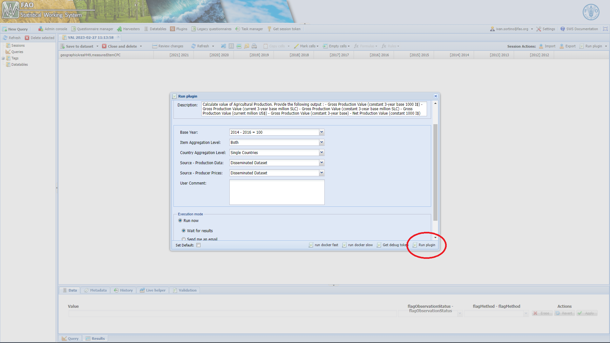

# Value of Production Plugin

## Data Flow

The general workflow of the Value of Agricultural Plugin can be summarized as follow :

 

From **Input data \--> Gross production calculation \--> Gross Production index Number calculation \--> Aggregates calculations \--> Final Output**

 

{}
 

The function require as input Production in tonnes and Annual Producer prices. The calculation will be performed for all the items defined in the supporting data table `"Value of Production - Item"` and for all the countries in `"Value of production - Country"`, then aggregated at item-group and region level. The aggregation at region level will follows groups composition specified in FAOSTAT, the plugin will also adjust the composition of the groups by years to match the correct composition according to the validity period of each countries. \

### Input data Flow

The source of inputs data for the plugin is structured as follow:

{ width=150% }

The plugin allows the user to choose the source for both Production and Prices through two different parameters, for instance, if some data is currently unavailable in `Disseminated Datasets` it is possible to select another source for the calculation. It is worth noting that pulling data from production datasets may lead to different results with respect to the disseminated one since some of the source data may differ or miss respect to FAOSTAT data.

#### Additional informations 

  -  The plugin will automatically pull data for indigenous meat with element code [55100] instead of [5510] 
  - The production quantity for CPC Item *Other meat n.e. (excluding mammals)*  [21170.92] will be pulled from SWS with item code [21119.90] instead. 

## Aggregates

The plugin calculate the Gross Production value at different aggregation value :

  - Item groups and Regions 
  
  - Regions and single-Items
  
  - Item groups and Regions.
  
The items and countries group lists are obtained from the "Definitions and Standards" section of the dissemination platform website ( [FAOSTAT](https://www.fao.org/faostat/en/#data/QV) ).
They are described and reported on the [SWS Resources section](#resources) section of this documentation.\

It is important that the technical unit validate those table to ensure that they are up-to-date and the right aggregations are performed.\

## Run the module

  1. Log-in into [SWS](https://sws.fao.org/);
  
  2. Select **New Query** and choose `Agriculture Production` Domain, `Value of Agricultural Production` dataset;
  
  3. Select the geographicAreaM49, measuredElement, measuredItemCPC and timePointYears in which you are interested and run the query;
  
{scale=110% }

  4. Once you created your session select run plugin as shown in [picture below](#screenuno);
  
{#screenuno scale=110% }

  5. Select the parameters: level of aggregation and Data sources. The user can also choose the execution method for the plugin, if many elements and long time-span are selected, it is suggested to choose the "send me an email" option since it can take a few hours to run entirely. 
  
{ scale=110% }  
