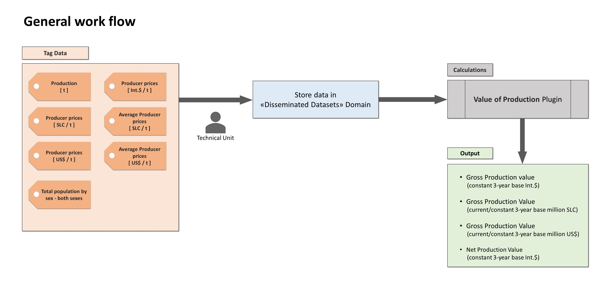

--- 
title: "Value of Agricultural Production"
author: "ivan.sortino@fao.org"
date: "`r Sys.Date()`"
site: bookdown::bookdown_site
header-includes:
- \usepackage{caption}

output:
latex_engine: tinytex
documentclass: book
url: https://github.com/SWS-Methodology/faoswsValueOfAgriculturalProductionDocumentation
favicon: ./images/FAO_logo.svg.ico
cover-image: ./images/FAO_logo.svg.png
description:
github-repo: https://github.com/SWS-Methodology/faoswsValueOfAgriculturalProductionDocumentation
---

# About

The aim of this module is to calculate the Value of Agriculture production within the Statistical Working System (SWS). The implementation of the procedure needs to be validated by matching the results disseminated by FAO until now. \
In order to perform the validation, disseminated data needs to be available within SWS in the corresponding dataset of _Dissiminated Dataset_ Domain.
After the validation, the procedure can be applied on the corresponding production value and prices presents within the system and stored in a new "Value of Production" dataset.

## Agriculture Production Validated 

To validate the module, a data cleaning and harmonization process was carried out in October 2023, aligning the data from both FAOSTAT, `Agriculture Production` dataset and `Agriculture Production - Validated` dataset. The primary objective of this activity was to guarantee consistency in the data points between the Production live dataset and the FAOSTAT dissemination platform. The revisions primarily focused on data from the period spanning 1961 to 1990, where FAOSTAT had previously reported an older version of the Production Data.
 
## Module Workflow 

As shown in the figure below, the general workflow of the module require that the Technical Unit store data in "Disseminated Dataset" to allow the plugin to ingest the right data.

{ }

## Build up data for validation of procedure

For the validation of the existing procedure, data are imported into different supporting datatable in SWS. For instance Item list, Countries list and group compositions are fetched as follow:

  - Country list is obtained from _Definitions and standards_ section of FAOSTAT ["Value of Production"](https://www.fao.org/faostat/en/#data/QV) dataset and uploaded into SWS [`Value of production - Countries`](#countrytab) datatable;

  -  Country group list is obtained from _Definitions and standards_ section of FAOSTAT ["Value of Production"](https://www.fao.org/faostat/en/#data/QV) dataset and uploaded into SWS [`Value of Production - Country Group`](#countrygrouptab) datatable;

  - Item list is obtained from _Definitions and standards_ section of FAOSTAT ["Value of Production"](https://www.fao.org/faostat/en/#data/QV) dataset and uploaded into SWS [`Value of Production - Item`](#itemtab) datatable;
  
  - Item group list is obtained from _Definitions and standards_ section of FAOSTAT ["Value of Production"](https://www.fao.org/faostat/en/#data/QV) dataset and uploaded into SWS [`Value of Production - Item group`](#itemgrouptab) datatable;

  - International prices are obtained from FAOSTAT FENIX ["_Producer Prices - Supplementary_"](http://fenix.fao.org/faostat/internal/en/#data/PX) dataset and uploaded on SWS `Supplementary International Dollar` datatable;
  
A detailed description of each supporting datatable is reported in [SWS resources](#datatables) section of this documentation. 

Since historical disseminated data may differ from those present on the Statistical Working System, it is necessary to make it available on SWS. To do this the CSI-SWS technical team need to retrieve the data from the the dissemination platform (FAOSTAT) and update it on `Disseminated Domain`. Once the procedure is done, Production and Prices data will be in line with disseminated one and the calculation should match the historical data.


## SWS implementation procedure

The plugin will work within a session, meaning that the user needs to select the elements and the years for which they intend to calculate the Value of Agriculture Production, then run the plugin within the new created session. 
It is worth noting that for the sake of consistency with FAOSTAT item/country list and for calculation of the aggregates, the plugin will always return values for all the countries and items specified into the supporting data table `"Value of production - Countries"` and `"Value of Production - Item"`

The module will pull its data directly within the working system, allowing the user to choose the source of data both for Production data and for Annual Producer Prices. For instance, if Disseminated Datasets source is not selected:

  - Production data in tonnes (_element 5510/55100_) are pulled from  `Agriculture Production` domain, dataset `Agriculture Production`;
  
  - Annual Producer Prices data for Standard Local Currency (_element 5531_) and US Dollar (_element 5532_) are pulled from `Producer Prices` domain, dataset `Annual Producer Prices (Validated)` 
  
  - Annual Producer Prices data for International Dollar (_element 5533_) are pulled from `Producer Prices` domain,  dataset `International dollar prices`.
  
If Disseminated Datasets source is selected, the plugin will pull its data from the corresponding datasets of the "Disseminated Datasets" domain, however since International dollar prices are not disseminated, they will be always fetched in "Producer Prices" domain.\
For the calculation of the element 434 "Gross per capita Production Index Number" the plugin will require also the total population by sex, element 511 from `Population Disseminated` of `Disseminated datasets` domain. \

<br>

For the correct functioning of the module it is important to ensure that the read permissions on the datasets mentioned above are correctly guaranteed. 

## Output of the plugin

The module will return the time series for all the elements selected in the session. The output elements are listed in the table below: 

<br>

```{r echo=FALSE}
element = c('56','55','57','58','152','154','432','434')

desc = c('Gross Production Value (current thousand SLC)',
'Gross Production Value (constant 3-year base thousand SLC)',
'Gross Production Value (current thousand US\\$)',
'Gross Production Value (constant 3-year base thousand US\\$)',
'Gross Production Value (constant 3-year base thousand I\\$) ',
'Net Production Value (constant thousand I\\$) ',
'Gross Production Index Number',
'Gross per capita Production Index Number'
)


knitr::kable(data.frame(Element = element, Description = desc ) , caption = "Value of Agricultural Production Plugin calculated elements.", col.names = c("Element Code", "Element descriptor") )

```

